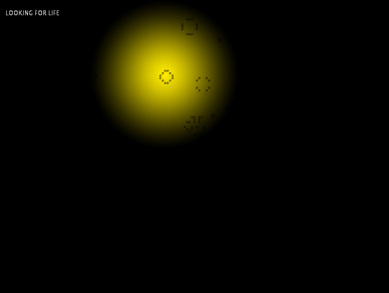

## BEGEISTERNDE BINARITÄT
### Looking for Life

_Alice Maria Rzezonka_

Gebe „Conway’s Game of Life“ in die online Suchmaschine deiner Wahl ein und du erhältst circa vier Millionen Ergebnisse. Unter den Bildern finden sich einfache schwarz-weiße Raster, die an Käsekästchen erinnern, bis hin zu komplexen dreidimensionalen Formen, die in die Unendlichkeit zu streben scheinen. Videos zeigen wuselnde Pixel, die an bakterielles Wachstum erinnern und mit Worten wie „epic“ betitelt sind. Worum handelt es sich bei diesem so einfältig klingenden „Spiel des Lebens“?

Alle Visualisierungen basieren im Wesentlichen auf Regeln, die der Mathematiker John Conway im Jahr 1970 entwickelte. Conway war auf der Suche nach einem System, das aus sehr einfachen Parametern sehr komplexe Zustände erzeugen konnte. Er nannte die Umgebung, die er dazu schuf „Life“, da er davon ausging, dass seine „Organismen“ sich darin ähnlich realer Organismen verhalten könnten – Wachstum, Entwicklung, Bewegung, Fortpflanzung, Tod und vielleicht sogar intelligentes Verhalten waren seine ehrgeizigen Ziele. Bemerkenswerterweise entwickelte Conway die dazugehörigen Regeln mit einfachsten Mitteln. Manche sprechen von einem Schachbrett mit Steinchen andere von Karopapier, wahrscheinlich nutzte er beides bei diesem sehr zeitaufwendigen Unterfangen. Conway ging von einem zweidimensionalen Raster aus auf der jede Zelle entweder im Zustand „lebendig“ oder „tod“ existiert. In regelmäßigen Intervallen erneuert sich das gesamte Raster und die einzelne Zelle kann abhängig von ihren Nachbarzellen in ihrem vorherigen Zustand weiterexistieren, „sterben“ oder „geboren werden“. Zu diesem Zweck mussten stringente Regeln aufgestellt werden, die bestimmen, wann eine Zelle in einen neuen Zustand wechselt.

Dieses Prinzip war damals bereits bekannt und wurde 1940 von Stanislaw Ulam als „Cellular Automaton“ vorgestellt. John von Neumann entwickelte die Idee Ulams weiter und beschrieb einen in der Theorie sich selber reproduzierenden auf 29 möglichen Zuständen basierenden universellen Automaton. Das Hauptproblem besteht allerdings darin, dass viele Regeln zu monotonen oder sich wiederholenden Mustern führen. Durch akribische Versuche konnte John Conway das folgende Regelwerk aufstellen, das genau dieses lebendig erscheinende komplexe und unvorhersehbare Verhalten produziert, welches das „Game of Life“ so lebendig wirken lässt:

- Eine tote Zelle mit genau drei lebenden Nachbarn wird in der Folgegeneration neu geboren.
- Lebende Zellen mit weniger als zwei lebenden Nachbarn sterben in der Folgegeneration an Einsamkeit.
- Eine lebende Zelle mit zwei oder drei lebenden Nachbarn bleibt in der Folgegeneration lebend.
- Lebende Zellen mit mehr als drei lebenden Nachbarn sterben in der Folgegeneration an Überbevölkerung.

Begeisternd an diesem simplen auf binären Zuständen beruhenden Regelwerk ist die ohne Zufallswerte aus sich selbst entstehende Komplexität des Geschehens, die stets an der Grenze zum Chaotischen verharrt ohne in dieses zu verfallen. Genau dieser Zustand scheint das was wir unter „Leben“ verstehen auf verblüffende Art und Weise so gut zu erfassen, das Conway und andere Wissenschaftler die These aufstellten, dass die gesamte Existenz möglicherweise auf einem ähnlichen nur in die Unendlichkeit multiplizierten „Cellular Automaton“ beruhte. In dieser Vorstellung ist beispielsweise jede Zelle unseres Körpers eine Zelle in einem System, das in Intervallen ihren Zustand erneuert, genauso wie jeder Teil dieser Zelle wiederum und so weiter. Dieses deterministische Weltbild wird auch heute noch von einigen Wissenschaftlern vertreten, Stephen Wolfram sei an dieser Stelle genannt. Zudem existieren einige Beispiele aus der Biologie, die mithilfe „Cellular Automata“ erforscht werden konnten. Den größten Beitrag leisteten „Cellular Automata“ allerdings im Bereich „Artifical Live“- und „Artifical Intelligence“-Forschung. Die wissenschaftliche Bedeutung kann hier nicht in Gänze ausgeführt werden und soll auch nicht das Hauptaugenmerk dieses Beitrags sein.

Denn aus der Perspektive der Designerin und des Designers stellt sich viel mehr die Frage wieso das vor 40 Jahren mit Papier und Stift entwickelte „Game of Life“ auch heute noch in so vielen Visualisierungen für Begeisterung sorgt. An dieser Stelle ist es zunächst wichtig, zwischen der Visualisierung und dem abstrakten Konzept zu unterscheiden. Bei dem Konzept handelt es sich um ein rein binäres System, Zellen können entweder den Zustand „tod“ oder „lebendig“ annehmen. Alle weiteren Beobachtungen, wie beispielsweise die Bewegung von Zellgruppen über den Bildschirm, sind im eigentlichen Sinne Interpretationen des Betrachters. Denn bei der vermeintlichen Bewegung von Zellen handelt es sich um das aufeinander abfolgende Sterben und Aufleben benachbarter Zellen. Des Weiteren ist das visuelle Ergebnis des „Game of Life“ stark von der Ausgangssituation, also der initialen Verteilung von toten und lebendigen Zellen abhängig. Es gibt ausgeklügelte initiale Verteilungen, bei denen sogenannte Kanonen entstehen, die Zellen über den Bildschirm zu schießen scheinen. In Eric Weissteins Sammlung „treasure trove of The Game of Life“ finden sich beispielsweise zahlreiche Muster, die innerhalb des „Game of Life“ entstehen können und unter Namen wie „Dove“ oder „Spaceship“ katalogisiert und beschrieben werden. Hier werden die visuellen Relikte, die mithilfe dieses abstrakte Regelwerks produziert werden, ähnlich einem real zu erforschendem Ökosystem behandelt. Es wäre leicht dies als Spinnerei abzutun, doch es existieren Versuche in denen das „Game of Life“ die gleichen Ergebnisse produziert wie bakterielles Wachstum (siehe auch: CODE FROM NATURE Agustina Andreoletti).

Neben dem Wunsch die Ergebnisse des „Game of Life“ besser zu verstehen, finden sich zahlreiche Beispiele, in denen dieses aufgrund seiner visuellen Qualität verwendet wird. Aber worin besteht die visuelle Qualität eigentlich? Zum einen ist da dieses Flackern, das vielleicht an den Blick in eine Flamme erinnert, zum anderen fasziniert die unvorhersehbare Entwicklung auf dem Bildschirm. Nicht zu vernachlässigen ist zudem, wie einfach das „Game of Life“ in den meisten Programmiersprachen darstellbar ist: Mit wenigen Zeilen Code entstehen komplexe Muster. Ein Raster ist damit leicht zu bespielen. Anders verhält es sich im Bereich der generativen Gestaltung, in der das „Game of Life“ als Generator komplexer Formen dienen kann beispielsweise im dreidimensionalen Raum. Hier wird das lebendige Flackern zugunsten einer scheinbar „natürlich“ gewachsenen Form überschrieben.

Doch welche Form auch immer die Gestalterinnen und Gestalter dem „Game of Life“ geben, es bleibt doch immer die Interpretationsleistung des Menschen in diesem Gewimmel Leben zu sehen und sehen zu wollen. Denn das Model hinter dem „Game of Life“ hat — äußerst überspitzt formuliert — so viel mit vermeintlich realem Leben gemein wie ein Kaminfeuer auf dem Bildschirm. Es ist der menschliche Filter, der beides als lebendig wahrnimmt, und möglicherweise gar nicht anders kann.
