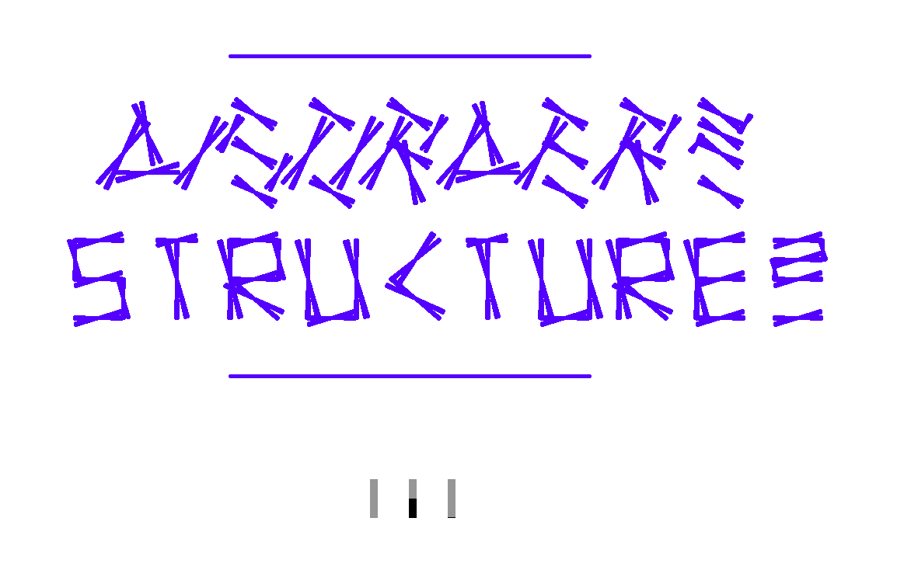

## Weisen Programme den Weg?

_Hanna Schumacher_

### Einstieg
Um mich an mein Thema des Textes langsam heranzutasten starte ich mit einem Zitat von Vilém Flusser aus Kommunikologie weiter denken, die „Bochumer Vorlesungen“: „Apparate schlagen auf den  Menschen zurück. Zwar sind Apparate unverhältnismäßig dümmer als die dümmsten aller Menschen, aber sie schlagen auf die Leute zurück und verwandeln sie zu Funktionären“. – (S.94)

Weiter im Text geht er auf Menschen in einer Diskothek ein, die mit Hilfe von Schallwellen dazu geleitet werden reflexartig zu handeln, und sie tun dies, weil sie es müssen und nicht, weil sie es selbst so wollen, sie werden also durch diese Schallwellen dazu geleitet etwas zu tun, dass sie nicht selbst möchten.

### Meine eigenen Erfahrungen
Ich selbst habe solch eine ähnliche Erfahrung an der KISD gemacht. Ich wollte für meine noch zu erreichenden Seminarpunkte etwas an meiner Baugruppe  im Programm ‘Solid Works’ ändern. Leider hat sich das als schwieriger herausgestellt als ich dachte. Als ich dann später zu Herrn Eichhorn meinte, ich ändere jetzt nichts mehr, war sein Kommentar darauf: „Das dürfen Sie aber nicht zur Gewohnheit werden lassen denn sonst lässt man sich vom Programm leiten und macht nicht das was man machen möchte.“

Das Problem ist klar, lässt man ein Projekt so, wie es die Maschine möchte, verzichtet man also darauf sein Projekt nach eigenen Wünschen zu gestalten.

Jetzt stellt sich mir die Frage, ist das nur bei einem schon fertigen Programm so, bei dem mir keine weiteren Möglichkeiten bleiben als die, die mir das feststehende Programm bietet. Und, wie ist das beim Programmieren.

### Die Programmiersprache
Hier zitiere ich Wikipedia: Eine Programmiersprache ist eine formale Sprache zur Formulierung von Datenstrukturen und Algorithmen, d. h. von Rechenvorschriften, die von einem Computer ausgeführt werden können. Sie setzen sich aus Anweisungen nach einem vorgegebenen Muster zusammen, der sogenannten Syntax.

Während die ersten Programmiersprachen noch sehr an den Eigenschaften der jeweiligen Rechner orientiert waren, verwendet man heute meist problemorientierte Sprachen, sogenannte Hochsprachen, die eine abstraktere und besser verständlichere Ausdrucksweise erlauben. In diesen Sprachen geschriebene Programme können automatisiert in Maschinensprache übersetzt werden, die von einem Prozessor ausgeführt wird. (http://de.wikipedia.org/wiki/Programmiersprache)

Schnell wird klar, auch hier wird man geleitet. Zwar ist man freier in seinem Tun, da man einen eigenen Code schreibt und nicht mit den festen Vorgaben eines Programms arbeitet, jedoch braucht man eine Sprache um den jeweiligen Code auch wirklich schreiben zu können.
Somit wird man dazu geführt, diese zu erlernen um das Programm bedienen zu können. Es bleibt uns also nichts anderes übrig, als das Programm über sich zu stellen und das zu tun was nötig ist um das Programm zu verstehen und zu beherrschen. Man funktioniert letzten Endes für das Programm, denn man braucht das Programm um weiterzukommen und lässt sich, wie schon zuvor gesagt, von ihm ‘leiten’.

### Man lässt sich immer leiten, anders geht es nicht. Oder?
Mit dieser Frage und der Bedeutung dieser unter anderem auch für das Design, beschäftigen sich schon einige andere. Möchte man nicht das gestalten was man selbst möchte und nicht das was von der »Maschine«,oder in diesem Fall dem Programm, aufgezwungen wird.

Geht man etwas näher auf die Frage ein kommt man zu dem Schluss, dass beispielsweise einem Designer, egal ob er mit einem Programm oder an einem Modell arbeitet, immer wieder Grenzen aufgezeigt werden. Schon alleine die Frage nach dem Material, aus dem man ein bestimmtes Produkt am Ende herstellen möchte, grenzt das Design stark ein.

Auch die Frage nach der Herstellung zeigt uns weitere Grenzen im Design auf. Vereinfacht man die Gestaltung seines Objekts soweit, dass es einfach, ohne viel Aufwand und in größeren Mengen herstellbar ist und kann somit die Produktionskosten und auch den Verkaufspreis gering halten oder entscheidet man sich sein Produkt so zu entwerfen, wie man es eben als ‘der Designer’ möchte und nimmt eine geringere Produktions- und auch Verkaufsmenge hin, da es durch die Gestaltung nicht möglich war sein Produkt in großen Mengen schnell herzustellen.

Aber all dies sind  letzten Endes auch Grenzen die ein Designer braucht um endlich zu einem Ergebnis zu kommen und sich nicht von unendlichen Lösungen leiten zu lassen. Denn man kann etwas nie so gestalten wie man es sich im Kopf vorstellt.

Geht man mit  der Fragestellung wieder auf das Programmieren zurück kommt man auch hier zu einem klaren Ergebnis.  Sicher hat man die Möglichkeiten, vor allem wenn es ums Programmieren geht, all seine Ideen zu verwirklichen, jedoch ist es doch auch gut das es Grenzen gibt, da man ohnehin nicht alles was das Programm hergibt, ausprobieren bzw. ausnutzen kann. Sonst versinkt man allzu schnell in der Unendlichkeit der Möglichkeiten.