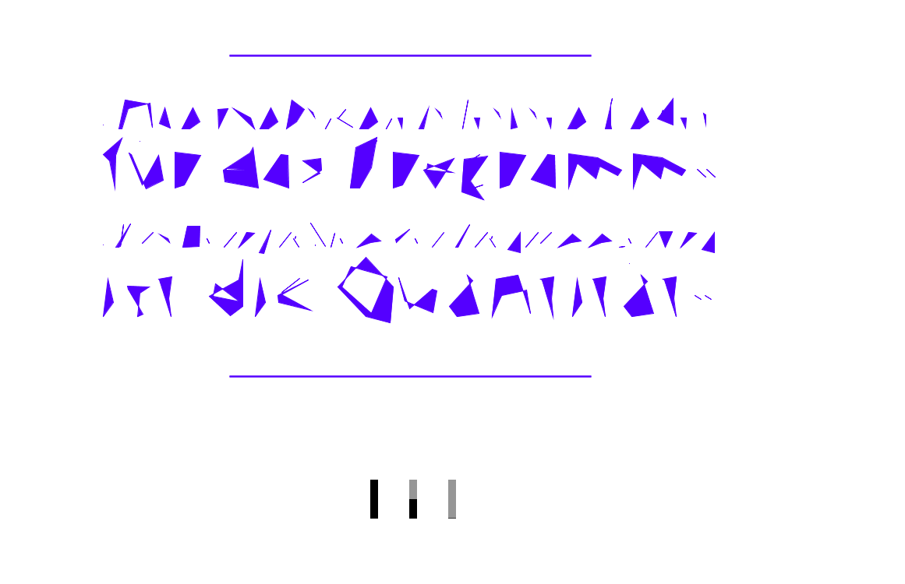

# Komplexität vs Einfachheit

_Stephanie Paeper und Franziska Volmer_

### Hardware != Software
Mit verhältnismäßigem Aufwand können wir einen Computer mit Hilfe von Programmierung dazu bringen sich so zu verhalten wie wir es wünschen. Das verhalten eines Computers äußert sich nur in der Ausgabe von Zeichen und Pixeln auf dem Bildschirm, dies ist für uns nicht greifbar, jedoch wichtig für die Programmierung. Man spricht dann von Software, im Gegensatz zur Hardware, der eigentlichen Maschine, welche die Rechenoperationen durchführt. Die Entwicklung von einfachen und noch übersichtlichen mechanischen Maschinen, die nur eine konkrete Aufgabe erfüllen konnten, zu komplexen Computerprogrammen, die nun universell gebraucht werden können, war rasant. Das Programmieren scheint in einer philosophischen Weise unerschöpflich. Es scheint wie eine kleine, nach seinen eigenen persönlichen Gesetzmäßigkeiten selbst erbaute Welt.

Uns soll hier zunächst nur das Problem interessieren, wie sich umfangreiche oder komplexe Systeme mit einem Programm beschreiben lassen. Denn im Prinzip ist Programmieren ganz einfach, so wird es einem oft dargestellt: Man gibt dem Rechner einige Befehle an, welche dieser ausführt, und das war´s. Theoretisch!

Dieser Essay zielt nicht auf Vollständigkeit ab, sondern soll nur unseren Einblick, als Programmier-Neulinge, die Materie “Programmierung” schildern.

Bis jetzt bestanden unsere Programme höchstens aus sechs Zeilen Code. Das ist nicht viel. Aber binnen kurzer Zeit wurden unsere Programme komplexer und dadurch länger. Aus den 6 Zeilen wurden ganz schnell 50, ja sogar 100 bis 1000 sind nach einiger Zeit nicht unüblich. Darum brauchen wir Funktionen; um Befehle zusammen zu fassen und je nach Bedarf, beliebig ausführen zu können. Funktionen halten das Skript modular, reduzieren den Code, lassen sich schnell an verschiedene Szenarien anpassen und bringen mehr Effizienz beim Managen.

Wir wollen so wenig Schreibaufwand wie möglich erledigen. Wichtig ist also grundlegende Schreibweisen zu kennen, jedoch kann man auch über Umwege zum Ziel gelangen, die jedoch den Ausmaß um einiges erhöhen.

Aber was möchte man überhaupt programmieren, was soll die Maschine am Ende können und tun sollen, inwieweit soll sie selbständig und inwieweit soll sie dies auf Anweisung tun? Wie kann man sein Konzept umsetzen? Und vor allem: wie sage ich nun dem Computer was er tun soll? Welche Sprachkonstrukte brauche ich dazu?

### Anfänger && Sprache erlernen
Um in die interaktive Welt einzutauchen, muss man “lediglich” eine spezifische Sprache erlernen, wobei diese auch schon eine stark vereinfachte Version der Programmiersprache Java ist. Dennoch ist sie abstrakt genug, um nicht direkt aus dem “Effeff” von uns beherrscht zu werden.

“Lerne nicht eine Programmiersprache, sondern das Programmieren.”, ein Zitat, was wir einmal aufgeschnappt hatten. Es muss wohl in Fleisch und Blut übergegangen sein, bis man dann wirklich seinen ganz eigenen Code zusammenschreibt.

Mit unserer geringen Coding-Erfahrung haben wir schnell gelernt, nicht alles komplett von vorne neu zu konstruieren. Dafür gibt es ein Vielfaches an Möglichkeiten. Ein Blick ins Internet genügt und man findet reichlich Kopiermaterial, sowie einige Libraries. In dieser Hinsicht sind wir gar nicht so weit von den Profis entfernt, denn auch die versuchen mit dem Verfahren Zeit und unnötigen Aufwand zu sparen. Aufgrund der Abitrarität der Variablennamen, die wir in den vorgefundenen Codes entnommen haben, ist es uns dennoch schwer gefallen, den Sinn des Codes zu verfolgen. Daran sieht man, dass es nicht allein ums Coding geht, sondern auch um das Analysieren, Verfolgen, Lesen und Verstehen von Codes, so wie der Fehlerbehandlung.

Grundsätzlich besteht unsere Herangehensweise darin, dass wir basierend auf oberflächlichen Informationen, wie Variablennamen und Kommentaren den Output oftmals versuchen zu erraten, statt ihn logisch herzuleiten. Anweisung, die nicht in unsere Vorstellung passten, ignorierte oder missinterpretierte man schnell. Oder eine noch fast bessere Methode ist es, Zeile für Zeile auszukommentieren und jeweils immer den “Run”-Button anzuklicken und die Veränderung abzuwarten.

Dieses iterative und explorative Vorgehen ist ungeheuer befriedigend.  Die Erfolgserlebnisse kommen schnell und häufig, man bekommt jederzeit Feedback und strukturiert den Code dabei laufend um, so dass er /*hoffentlich*/ am Schluss allgemeiner, veränderbarer, weiterverwendbarer geworden ist.
Das bedeutet z.B. dass man zuerst konkrete Werte /*Koordinaten, Farben usw.*/ verwendet, damit man schnell Ergebnisse sieht und überprüfen kann, ob es so geworden ist, wie man es sich vorgestellt hatte. Diese konkreten Werte lagert man dann in Konstanten /*damit sie schnell global geändert werden können*/ und schließlich in Funktionsparameter aus /*damit man später nur an einer Stelle Änderungen vornehmen muss. /*Abstraktionsprinzipien müssen also beherrscht werden.*/

Wir konzentrierten uns häufig nur auf kleine Programmsegmente und machten dabei Annahmen was die anderen Programmteile tun. Während erfahrene Programmierer wahrscheinlich einen Code hinsichtlich in seiner Gesamtheit schnell erfassen können und Verknüpfungen herstellen können. //Von dem sind wir noch weit entfernt

Sehr Hilfreich ist die Nutzung der Kommentarfunktion. Teilweise haben wir Zeile für Zeile kommentiert, um zu einem besseren Verständnis zu gelangen und visuelle Abschnitte zu schaffen. Desweiteren bieten Kommentare die Möglichkeit Hintergrundinformationen bereit zustellen, welche nicht sofort ersichtlich sind, z.B Library Verweis, der Einstieg wird erleichtert und andere Kollegen, die am gleichen Projekt arbeiten, können den kryptischen Code und die wirren Konzepte besser entziffern.

Oft ist die Vorstellung vorhanden, dass der Computer das Programm so interpretiert wie wir Menschen. Man hat seine ganz eigenen Vorstellungen, wie ein Konstrukt interpretiert werden soll und nimmt schnell an, dass auch der Computer dieselben Interpretationen vornehmen kann. So wird der Computer häufig fälschlicherweise als ein System betrachtet, welches normale menschliche Fähigkeiten besitzt und vom Gemeinten auf das Gesagte schließen kann. Unterstützt wird dieser Eindruck oft dadurch, dass man salopp daher redet, wie „er probierte….“ oder „er dachte…“. Oft wird auch der Eindruck vermittelt, dass der Computer schlauer sei, als die Benutzer/innen selbst. Man muss sich klar machen, dass der Computer eine sehr limitierte rationale Einheit ist und dass dieses Objekt keinen Intellekt besitzt. Diese Strategie kann einem die Angst oder Ehrfurcht vor der mysteriösen Maschine nehmen, die mancheiner verspürt.

Unangenehm wurde es, als die Codes begannen einen Beigeschmack von Mathematik zu bekommen. Ein Grund dafür war, dass unser Wissen über Algebra uns teileweise irregeführt hat, was negative Emotionen hervorgerufen hat. Beispielsweise ist die Zuweisung A=A+1 in der Mathematik eine falsche Aussage.

Ein Vorzug von Processing ist, dass man innerhalb schon einer Minute eine erste Grafik auf seinem Bildschirm sehen kann. Und so bastelt man an diesem “Code-Fetzen” einfach immer weiter, bis man irgendwann in einen “Flow” kommt, wo einem Stunden wie Minuten vorkommen. Jedoch findet der Motivationsschub ein jähes Ende, wenn immer wieder neue Fehler auftreten. Im Endeffekt hangelt man sich von einem Problem zum nächsten.

### Struktur
Je Umfangreicher der Code wird, desto unüberschaubarer wird es /*zum Glück nicht nur für uns Anfänger*/ ihn zu verstehen. Die heutigen umfangreichen und komplexen Systeme sind kaum noch zu erfassen und was einzelne Befehle im Zusammenhang bewirken, kaum noch nachvollziehbar. Das Kernproblem der Programmierung ist also die Quantität. Um die Komplexität zu reduzieren werden einzelne Problem in Teilprobleme zerlegt, welche entweder direkt lösbar sind, oder wiederum in Teilprobleme zerlegt werden können. Dabei spielt die Strukturierung und die Abfolge eine sehr große Rolle.

Gute Strukturierungsmöglichkeiten bieten die Reiter in denen neue Klassen geschrieben werden können. Durch die Klassen wird eine Arbeitsaufteilung unter verschiedenen Leuten gewährleistet.

Ein weiteres Problem der Programmierung ist die übergroße Flexibilität, die die Aneinanderreihung beliebiger Befehle gewährt. Um Missverständnisse aus dem Weg zu räumen und einen Überblick zu erhalten, empfiehlt es sich daher ein flow chart /*Flussdiagramm*/ anzufertigen. Dadurch wird einem die Reihenfolge des Ablaufes verdeutlicht.

Strukturierung ist also ein sehr wichtiger Faktor in der Programmierung. Denn alles was uns vertraut und übersichtlich erscheint, gibt uns Sicherheit, Stabilität und bietet Orientierung, die uns bei der Organisation des Programms helfen und wir somit die Kontrolle behalten können /*Können wir das wirklich?*/. Aber dadurch wird uns die Arbeit erheblich vereinfacht.

Grundsätzlich sollte der Programmablauf in seinen wichtigsten Schritten kommentiert werden. Die Komplexität wird überschaubarer durch den Zuwachs an Erfahrungen. Jedoch wird auch mit einer guten Strukturierungstechnik das Programm immer komplex bleiben.

### Fazit
All die beschriebenen und auch sinnvollen Methoden haben wir in unserem Kurs gelernt. Sie beziehen sich bei uns jedoch lediglich auf die theoretische Betrachtung. In unserer praktischen Arbeit haben wir uns jedoch kaum an diese Aspekte halten können, da wir viel zu viel mit den restlichen Anforderungen beschäftigt waren. Wo anfangs noch klare formelle Strukturen aufgewiesen werden konnten, herrschte später absolutes Chaos.
Unser Code ist 1091 Zeilen lang, besitzt keine Klassen, 23 Funktionen und nur den ein oder anderen Kommentar. Drückt man den “Run”-Button erscheint kein großes Programm auf dem Bidlschirm, dass nach viel Arbeit aussehen würde. War es aber! Es war viel copy-paste-Arbeit und wahrscheinlich ein viel zu komplizierter Weg um zu unserem Ziel zu gelangen. Und wahrscheinlich hätte man nur ein Drittel der Zeilenmenge benötigt, hätte man die Sprache besser beherrscht. Aber wir stehen noch am Anfang. Und so macht man das anscheinend als Anfänger /*jedenfalls wir*/. Das wichtigste war, dass wir uns mit dem Programm auseinandergesetzt haben. Wahrscheinlich würden wir das nächste Mal schon wieder ganz anders an die Sache herangehen. Aber so ist das. Ein normaler Lernprozess, bei dem wir nun gesehen haben, dass es wichtig ist, den Überblick zu behalten.

Unsere Ausführungen sollten Anlass für eine Diskussion der Frage geben, ob ein Mensch jemals ein wirklich komplexes System verstehen kann. Die Strukturierungstechnik verbirgt Details komplexer Systeme; jeder Programmierer braucht sich letzten Endes nur um seine spezielle Aufgabe zu kümmern. Es ist somit nicht notwendig, dass irgend jemand sämtliche Details eines komplexen Systems versteht, und vermutlich ist dieses bei ernsthaften Anwendungen auch niemals möglich.

Scheinbar harmlose Codeaufgaben werden unter verschiedenen Leuten aufgeteilt, die allerdings in der Gesamtheit ein unerwartetes Ausmaß annehmen können /*z.B. Virus, Hacking*/. Die Verantwortung der Programmierer ist demnach hoch und die Frage nach der Sinnhaftigkeit der Programmierung muss sich gestellt werden.