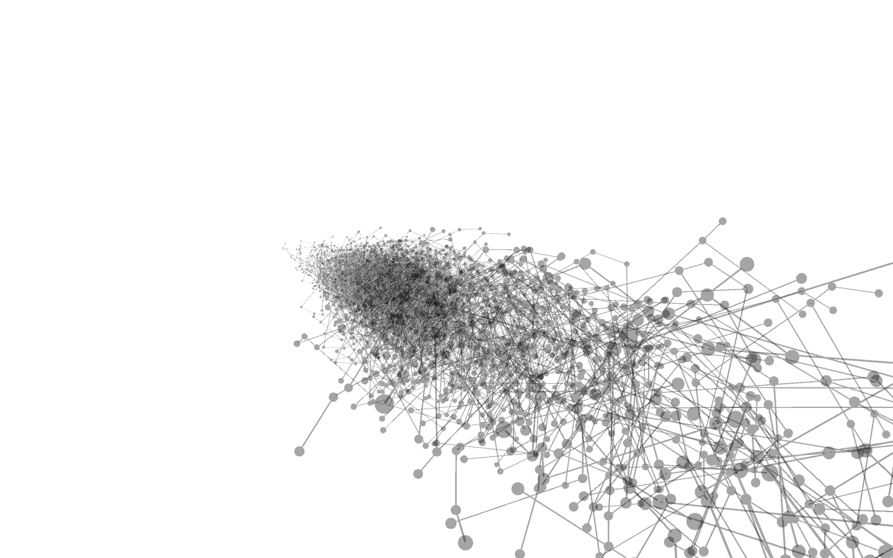
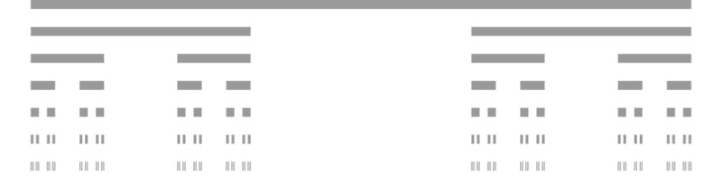

# Digitale Simulation - Von der natürlichen Schönheit der Zahlen

_Martin Moldenhauer_



Die Schönheit der Pflanzen hat die Aufmerksamkeit von Mathematikern und Wissenschaftlern seit Jahrhunderten sehr stark angezogen. Auffällig geometrische Merkmale wie die bilaterale Symmetrie der Blätter, der Rotationssymmetrie der Blumen und der spiralförmigen Anordnung der Skalen in Tannenzapfen wurden ausgiebig untersucht.

Dies wird gut in einem Zitat des Mathematikers Herrmann Weyl verdeutlicht,

>„Schönheit wird mit Symmetrie erzeugt.“

Gerade in Architektur und im Design finden sich immer wieder die Aufgaben, Strukturen zu schaffen und Symmetrie oder Asymmetrie zu erzeugen. Diese sind in vielen Fällen Kopien aus der Natur, wo diese Strukturen scheinbar selbstverständlich existieren.   

Durch Computer-Code gibt es die Möglichkeit die selbstverständlich, natürlichen Strukturen anhand von abstrahierten Formalismen am Monitor entstehen zu lassen und zu verstehen. Ein interessantes Beispiel in diesem Zusammenhang ist für mich die Darstellung von Simulation organischer Strukturen und biologischer Prozesse.   

Der Blick auf den Code selbst beschert dem informierten Betrachter ein ebenso natürliches Bild, welches den Code als verständliche Abstraktion begreifbar macht. Dem Leihen hingegen bleibt dies verwehrt und er versteht diese Art der Abstraktion erst wenn sie „compiled“, also durch die Maschine für ihn interpretiert wurde. Der Simulation von natürlichen Prozessen und Systemen gelingt es sogar das „Leben“ als solches auf den Monitor zu erschaffen, wie zelluläre Automaten eindrucksvoll zeigen. Die Verbindung von Mathematik und Design findet gerade hier für mich eine sehr interessante Schnittstelle. Fraktale sind beispielsweise Symmetrien, die sich erst durch die Visualisierung von mathematischen Formeln in Code gezeigt haben und so eindeutig eine Symmetrie hinter den Zahlen aufzeigen.  

Der ungarische, theoretische Biologe Aristid Lindenmayer (1925-1985) entwickelte um 1968 ein relativ simples, aber dennoch sehr leistungsfähiges Verfahren, um biologisches Pflanzenwachstum mathematisch zu beschreiben. In einem Lindenmayer-System (kurz: L-System) wird ein mehr oder weniger einfaches Grundmuster (Zeichenketten und Produktionsregeln), durch fortwährende Wiederholung in die zu beschreibende Form überführt.
Diese Schritte können rekursiv durchgeführt werden und gehören zu den sogenannten Ersetzungssystemen. Die Rekursion (lateinisch recurrere ‚zurücklaufen‘) ist eine Technik in Mathematik, Logik und Informatik, eine Funktion durch sich selbst zu definieren. Die Rekursion und die Iteration sind im Wesentlichen gleichmächtige Sprachmittel innerhalb von vielen Programmiersprachen.  

Dem polnischen Informatiker Przemysław Prusinkiewicz gelang erstmalig in Zusammenarbeit mit Lindenmayer und mit Hilfe der Programmiersprache Logo Pflanzenwachstum digital zu erzeugen. Da das zeichnende Objekt in diesem Programm eine Schildkröte war, wurde diese Art der Steuerung Turtle-Grafik genannt. Prusinkiewicz gelang es hierdurch, die beiden Welten des Formalismus mit der Computergrafik zu verknüpfen, so dass die, durch das Lindenmayer-System erzeugten, Zeichenketten als Befehlsfolge der Turtle-Grafik interpretiert wurden.  

Die Formenvielfalt dieses Formalismus reicht von einfachen Sträuchern, bis hin zu fotorealistischen Abbildungen kompliziertester pflanzlicher Strukturen. In jüngerer Zeit fanden L-Systeme hierdurch eine weite Anwendung in der Computergrafik, bspw. bei der Erzeugung von Fraktalen. Dies sind grundsätzlich natürliche oder künstliche Gebilde, oder geometrische Muster, die einen hohen Grad von Selbstähnlichkeit aufweisen. Unter Selbstähnlichkeit versteht man hier die Wiederholung einer bestimmten Struktur in sich selbst. Ein klassisches Beispiel für ein solches Gebilde ist die Schneeflocke.

Eine Rekursive Funktion:

1. Zeichne eine Linie

2. Entferne das mittlere Drittel und zeichne diese

3. Wiederhole Schritt 2 für die übrigen Linien, immer und immer wieder…

Diese Abfolge von Anweisungen beschreibt mit Worten, die im Jahre 1883 vom deutschen Mathematiker Georg Cantor entwickelten einfachen Regeln um eine unendliche Menge zu generieren.
Übersetzt in Computer-Code (Processing, Java) liest sich die obere Anweisung wie folgt:

```
void cantor(float x, float y, float len) {
	if (len >= 1) {                     // Wiederhole Schritt 2 für die übrigen Linien, so und so oft
	
	line(x,y,x+len,y);                //  - Zeichne eine Linie
	y += 20;
	cantor(x,y,len/3);                //  - Zeichne eine neue Linie vom Anfang bis zum Ende des ersten Drittels    
	cantor(x+len*2/3,y,len/3);        //  - Zeichne eine neue Linie vom Anfang des zweiten Drittels bis zum Ende
	}
}
```

<br/>



<br/>

Innerhalb solch einfacher Zeichenketten und Produktionsregeln entstehen nach nur wenigen Wiederholungen sehr komplexe Strukturen. Diese sind neben ihrer ästhetischen und natürlich anmutenden Faszination auch interessante Objekte zur Visualisierung von Daten.
Wie Chomsky`s Grammatiken die Grundlage für viele gängige Programmiersprachen sind, so ist der Formalismus der L-Systeme die Grundlage worauf Modellierungs- und Simulationssoftware zur Erstellung von Pflanzen grundsätzlich auch heute noch beruht.

Eine Baum-Struktur:

1. Zeichne eine Linie

2. Am Ende der Linie, (a) dreh dich nach Links und zeichne eine kürzere Linie und (b) dreh dich nach rechts und zeichne eine kürzere Linie

3. Wiederhole Schritt 2 für die übrigen Linien, immer und immer wieder…
Eine sehr natürlich anmutende Grafik entsteht ebenfalls bei den weit verbreiteten Baum-Fraktalen. Die obere Abfolge gibt Anweisungen zu deren Erstellung.
Übersetzt in Computer-Code (Processing, Java) liest sich die obere Anweisung wie folgt:

```
void branch(float len) {
	line(0, 0, 0, -100);            // Zeichne einen Stamm/Ast
	translate(0, -100);            // Verschiebe das Koordinatensystem
	pushMatrix();                //
	rotate(PI/6);                         // Rotiere nach rechts
	branch();                    // und verzweige wieder
	popMatrix();                //
	pushMatrix();                //
	rotate(-PI/6);                // Rotiere nach Links
	branch();                    // und verzweige wieder
	popMatrix();
}
```
<br/>


<br/>

Im Wesentlichen bestehen Grammatiken aus Zeichenalphabeten (zur Erzeugung von Zeichenketten) und Ersetzungsregeln (Produktionsregeln). Hierbei unterscheidet man die zwei Arten von terminalen Zeichen, die in den finalen Zeichenketten selbst vorkommen und nichtlineare Zeichen, die nur zur Strukturbeschreibung benutzt werden und im Laufe des Erzeugungsprozesses durch terminale Zeichen ersetzt werden müssen.   

Solche Grammatiken bieten den Nutzern von Simulationsprogrammen die Fähigkeit, Modelle einfach auszudrücken, ohne die Last diese von Grund auf selbst erstellen zu müssen oder auf statische Modelle zurückzugreifen, bei denen lediglich numerische Parameter Werte leicht variiert werden können. Dieser Vorteil ist gerade in der computergestützten biologischen Forschung besonders wichtig, da dies einen bequemen Mechanismus für die Festlegung und Änderung innerhalb von Experimenten mit allen Aspekten der Modelle ermöglicht. 

Auch im Bereich der Datenviaualisierung und Erzeugung generativer Gestaltung wird auf Muster, Symmetrien oder Asymmetrien aus der Natur zurückgegriffen. Einige sehr einfache und traditionelle Anwendungen hierzu ist das Liniendiagramm oder das Netzdiagramm zur Veranschaulichung komplexer oder dynamischer Dateninformationen. Ben Fry, einer der Entwickler von Processing selbst beschreibt dies sehr ausführlich in seiner Master-Thesis über „Organic Information Design“. Ein Beispiel ist hier etwa die „Anemone“, eine organisch simulierten Visualisierung der Aktualisierung von Inhalten und dem Verhalten von Usern auf einer bestimmten Webseite. Neue Teile der Struktur werden hinzugefügt während andere langsam ungenutzt verschwinden. Die jeweiligen Systeme besitzen organisch simulierte Eigenschaften, die in einer interaktiven, optisch vereinfachten Umgebung erzeugt werden, um qualitative Informationen aus großen Mengen von quantitativen Daten, die von dynamischen Informationsquellen erzeugt werden darzustellen. Einen der wichtigsten Teile stellt in diesem Zusammenhang der Prozess des rekursiven Wachstums von Organismen wie etwa im L-System dar. Die Veränderung innerhalb des Wachstums wird durch die Veränderung des darunterlegenden Codes (der Struktur der Dateien), abhängig von ihrer Informationsquelle vorgenommen. Die Zeichenketten hinter dem L-System, gespeist mit Daten, visualisieren dann die Informationen unter Berücksichtigung der Produktionsregeln des Systems. Interessant in diesem Zusammenhang ist nicht nur das Wachstum, sondern ebenfalls die Verkümmerung nicht verwendeter, bzw. unrelevanter Daten aus einem Datenpool.

Selbst wenn es sich beim Lindenmayer System um einen recht alten Formalismus handelt (1968), gibt es nach wie vor weite Anwendungsbereiche für dessen Einsatz innerhalb von computergestützter, naturwissenschaftlicher Forschung, Simulation, Modellierung und Erstellung von generativer, dynamischer Gestaltung. 


### Quellen:

[http://de.wikipedia.org/wiki/Lindenmayer-System ](http://de.wikipedia.org/wiki/Lindenmayer-System)  
[http://de.wikipedia.org/wiki/Rekursion](http://de.wikipedia.org/wiki/Rekursion)    
[http://benfry.com/organic/thesis-0522d.pdf](http://benfry.com/organic/thesis-0522d.pdf)  
[http://benfry.com/anemone/about/](http://benfry.com/anemone/about/)  
[http://algorithmicbotany.org/papers/abop/abop-ch1.pdf](http://algorithmicbotany.org/papers/abop/abop-ch1.pdf)  
[https://archive.org/details/Symmetry_482](https://archive.org/details/Symmetry_482)  
[http://natureofcode.com/book/](http://natureofcode.com/book/)   
[https://vimeo.com/album/2265325](https://vimeo.com/album/2265325)


