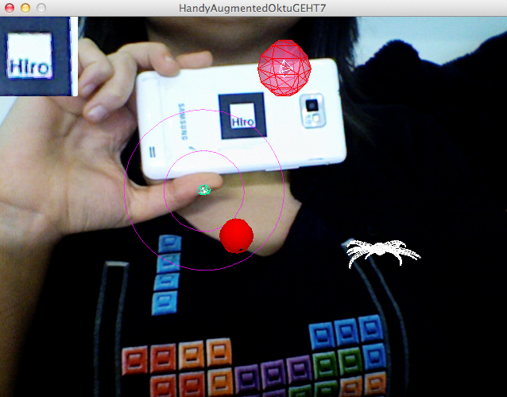

# Die Angst vor der Autonomie der Technik 2

_Dorothee Claasen_

Es ist nicht ungewöhnlich, dass sich Menschen gegen neuartige Technologien sträuben und ihnen skeptisch gegenüber stehen. Diese Form der Technikkritik scheint eine für den Menschen typische Haltung gegenüber neuen Technologien zu sein.

Die Angst vor der Entfremdung der Gesellschaft, von ihrem vermeintlich „natürlichen“ Lebenszustand verleitet Menschen dazu neuartige Phänomene, die durch die zunehmende Digitalisierung in unseres Alltag verflochten sind, als schlecht oder womöglich schädlich zu bezeichnen. Datenkapitalismus; Digitale Demenz; Big Date. Themen, die zu recht kritisch, jedoch oftmals auch höchst emotional diskutiert und für Hetzkampanien gegen neue Technologien verwendet werden.

In der Medientheorie lassen sich verschiedene hierzu finden. Franz Kittler, Joseph Weizenbaum oder Heinz von Förster beschäftigen sich beispielsweise kritisch mit dem Phänomen der Mensch und Maschine.

Vilém Flusser beschäftigt sich in seinem Werk „Kommunikologie weiter denken“ unter anderem mit der Macht des Programmierers und seine daraus resultierenden Macht gegenüber anderen Menschengruppen. Er schildet im Abschnitt „der Zahlencode“ eine Elitenbildung unter Programmierern, ähnlich der damaligen Elite, die in der Lage waren Schreiben und Lesen zu können und somit erhaben und mächtig über die restliche Bevölkerung herrschten.
„Bedenken Sie, das Alphabet wurde dank Gutenberg demokratisiert. Alle Leute konnten mit der Zeit schreiben und lesen, das Geheimnis war weg, und die Elite war erobert. Die Bourgeoisie und später das gloriose Proletariat, bekanntlich die Vorhut der Menschheit, haben die Macht an sich gerissen, insbesondere in der Sowjetunion. Irrtum! Im selben Moment, in dem man begonnen hat, das Alphabet zu demokratisieren, ist ein neuer Geheimcode entstanden: der Geheimcode der Zahlen.“[1]

> „Also hat die Elite der Zahlen, diese damals schon die Welt beherrschende Elite, durch die Mechanisierung des Zählens ihre Stellung nicht etwa verloren, sondern im Gegenteil, sie ist einen Schritt zurückck getreten vom Rechnen und ist in die abstrakte Sphäre dessen, was man heute Software nennt, über gegangen. Unsere wirklichen Herrscher, die Drahtzieher hinter allem, sind diese Leute.“[2]

Aber auch in der Literatur lassen sich zahlreiche Werke finden, die die selbe Thematik behandel. Sei es Don Quijote, der verzweifelt versucht gegen Windmühlen anzukämpfen, oder Nathanael,  E.T.A Hoffmanns Romanfigur aus seinem Werk „Der Sandmann“, der entsetzt feststellen muss, dass seine Geliebte Olimpia ein Automat ist.

### Kein Einblick; Komplexe, digitale Systeme bestimmen unseren Alltag

Bei der Betrachtung unseres Alltags wird in der Tat schnell deutlich, dass wir von einer Vielzahl komplexer Prozesse und digitaler Systeme umgeben sind, deren inneren Prozesse sich scheinbar gänzlich unserer menschlichen Wahrnehmbarkeit entziehen. Die Logik, die diesen Programme durch Menschenhand einprogrammiert wurde basiert allerdings unweigerlich auf der Menschlichen Logik.

Die Programmierer dieser Strukturen können durchaus in der Lage sein, die Strukturen des Codes zu verstehen. In der Regel sind diese Systeme so konzipiert, dass zwischen Nutzer und Software ein ungemein leichter erfassbares Interface für eine effektive Nutzung zwischengeschaltet ist. Die Programmierer, oder vielmehr die Designer haben sich also dafür entschieden, dem Nutzer dieses Innere nicht sichtbar und zugängig zu machen.  Die Motive hierfür sind vielseitig und verfolgen unterschiedlichsten Bestrebungen.

Weizenbaum unterscheidet in seinem Werk „Die Naturwissenschaft und der zwanghafte Programmierer“ zwischen zwei Arten von Programmieren. Dem strukturierten, organisieren Programmiere, der vorm praktischen Schreiben des Programms  klar definiert, was es leisten soll, wie alle Komponenten miteinander Kommunizieren und plant alles sorgfältig um später, effektiv und konsequent die Programmierung am Computer vorzunehmen. Der krankhafte Programmierer hingegen verbringe die meiste Zeit alleine vor seinem Rechner und programmiere seine diffusen Programmstrukturen im verdunkelten Räumen bis spät in die Nacht. Durch diese unstrukturierte Herangehensweise schleichen sich in sein System zahlreiche Fehler ein, die er als Wiederwillen des Computers, sich seinem Programmierten zu fügen, als Herausforderung und Machterprobnis empfindet. Er arbeitet fieberhaft und verbissen an einer Eleminierung des entstandenen Fehlers, entwickelt weitere Sub-Systeme und vergrößert damit in der Regel das wacklige Konstrukt seines gesamten Programms.

„Aber da es keine allgemeine Theorie des Gesamtsystems gibt, kann das System selbst nur ein mehr oder weniger chaotisches Aggregat von Subsystemen sein, deren gegenseitiger Einfluss auf das Verhalten nur Stück für Stück und experimentell herausgefunden werden kann. Der Hacker verbringt einen Teil seiner Zeit am Schaltpult damit, die von ihm entwickelte Struktur mit neuen Subsystemen zu pflastern – er nennt sie »neue Features« – und den Rest der Zeit mit Versuchen, herauszufinden, in welcher Weise sich bereits installierte Substrukturen falsch verhalten. Das ist es, worüber er sich mit dem Computer unterhält.“[3]

Weizenberg vergleicht diesen Typ Programmierer mit einem spielsüchtigen Menschen, dessen Bezug zur Realität offensichtlich verrückt ist und dessen Sucht ihn krankhaft antreibt, die Macht über das Programmierte zu halten.

### Das Smartphone
Zu einem der gängigsten digitalen Begleiter hat sich das Handy entwickelt, das sich mittlerweile zum „Smart-Phone“ gewandelt hat und regen Anklang genießt. Es ist ohne große Bemühungen und Hintergrundwissen nicht möglich zu überblicken, wie im Einzelnen die zahlreichen Hardware- und Software-Teile zusammen arbeiten. Auch der Einblick in die programmierten Zeilen der Software  ist nicht möglich und lässt, sofern man sich dafür überhaupt interessiert, zahlreiche Fragen offen.

Designer müssen sich kritisch mit der Fragen auseinandersetzen,  wie weit der Blick in die komplexen, algorithmischen Systeme, die das Verhalten zahlreicher Alltags Artefakte bestimmen, für den Nutzer zugängig gemacht werden soll. Wollen, sollten und müssen Nutzer wissen, welche Prozesse sich im Hintergrund sich in ihren mit Software ausgestatteten Alltagsgegenständen abspielen?
