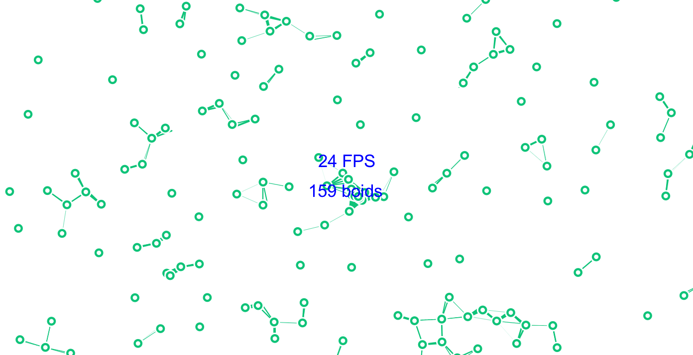

# Parallel Computing

_Evgenii Krivoruchko & Ilja Burzev_

 

 

### 1.
Die 1950 erfundene Von-Neumann Computerarchitektur ist das Fundament von modernen Computern. Die Basis dieser Architektur besteht aus einem zentralen Prozessor, der die Anweisungen in einer linearen Abfolge, eine nach der anderen verarbeitet. Diese Arbeitsweise beeinflusst die Art der Programmierung von Programmen, bei der der Entwickler sequenziell, Zeile
für Zeile einzelne Befehle formuliert, die von dem Computer hintereinander gelesen und ausgeführt werden. Das Verhalten der sequentiellen Ausführung der Anweisungen entspricht dem Aufbau der Sprache und der mathematischen Logik und letztlich dem allgemeinen Konzept von Grund und Ursache, das ein wichtiger Bestandteil des rationalen Denkens ist.  

Die Berechnung von Werten in einer linearen Abfolge stellt ein Problem dar, das später als "Von-Neumann Flaschenhals" bezeichnet wurde. Das Problem zeichnet sich darin aus, dass während der Berechnung eines Befehls nur ein kleiner Bereich im Speicher aktiv genutzt wird. Dabei bleibt der Rest des Speichers untätig. Aufgrund des relativ simplen Aufbaus dieses Entwurfs und des ursprünglichen Umfangs der Rechenaufgaben, wurde diese Technologie sehr populär und wird heute in nahezu allen Computern eingesetzt.

### 2.
In der Natur passieren viele komplexe, zusammenhängende Ereignisse gleichzeitig in einerzeitlichen Abfolge. Dies sind Prozesse wie Bildung von Galaxien, Bewegung von Planeten, Klimaveränderung, Wetter, Entstehung von Staus und Ähnliche. Einzeln betrachtet ist dieKalkulation der zu berechnenden Bestandteile eher simpel, jedoch die Menge und die gegenseitigeWirkung macht die Berechnung solcher Prozesse in einer linearen Abfolge sehr aufwendig, odersogar unmöglich.Parallel Computing ist eine Prozessorarchitektur,die aus tausenden Prozessoren bestehen kann,die gleichzeitig, unabhängig von einander mehrere Prozesse berechnen.   
Die Leistung dereinzelnen Prozessoren ist verglichen mit dem CPU eines herkömmlichen Prozessors viel schwächer. Da die Aufgaben intern auf allen Prozessoren verteilt werden, können viele Aufgabendennoch schneller berechnet werden. Auch der Speicher kann in diesem System effektiver belegtwerden. Um effizient die Rechenleistung nutzen zu können, muss jeder Befehl in mehrere Segmente gebrochen werden, die parallel von den Prozessoren verarbeitet werden. Die einzelnenKerne können unter Umständen gegenseitig Werte austauschen, die die Berechnung beeinflussen.  
  
Ein Koordinationsmechanismus führt die berechneten Daten wieder zusammen, um einGesamtergebnis zu erhalten. Sehr komplizierte Prozesse, bei denen eine Vielfalt an gleichzeitigwirkenden Faktoren berücksichtigt werden müssen, können mit der Parallel Computing Methodeschneller berechnet werden.Der erste Prototyp, der auf dem Prinzip von Parallel Computing arbeitet, wurde 1955 von IBM mitdem Hauptingenieur Gene Amdahl gebaut. Seitdem wurde die Architektur immer weiter entwickelt.Ab den 70er Jahren wurden derartige Computer als Super Computer bezeichnet. 1997 stellte derASCI Red Supercomputer (entwickelt um Explosionen nuklearer Waffen zu simulieren) mit einer Billion Berechnungen pro Sekunde einen Rekord auf.   

Bis heute wurde diese Technologie nur für wissenschaftliche oder militärische Zwecke genutzt und nie für den alltäglichen Gebrauch von OttoNormalverbrauchern konzipiert. Während der letzten Jahre änderte sich allerdings die Architekturvon dem herkömmlichen CPU. Es besteht mittlerweile hauptsächlich aus mehreren Kernen. DasPrinzip der Verarbeitung von Informationen hat sich zwar nicht verändert eswird immer noch nurein Prozess zur selben Zeit berechnet die Aufgabe von mehreren Kernen zu lösen verbraucht aber nicht so viel Energie wie nur ein hochgetakteter Kern. In einem Zeitalter von mobilen Endgeräten wird das Sparen von Energie immer essenzieller. Dies kann dazu führen, dass aus “einigen” ProzessorKernen “viele” werden und folglich auch die Rechenprozedur optimiert wird. Heute findet das Parallel Computing auf vielen wissenschaftlichen und technischen Gebieten statt:

##### Angewandte Physik
Nuklearenergie, Teilchen, kondensierte Materie, Hochdruck, Fusion, Photonik

**Biowissenschaften**  
Biotechnologie, Genetik

**Chemie**  
Molekularwissenschaften

**Geologie**  
Seismologie, Atmosphäre, Erde, Umwelt

**Maschinenbau**  
von Prothesen zum Satelliten

**Technik**  
Elektrotechnik, Mikroelektronik, Informatik

**Militär**  
Verteidigung, Waffen

Auch in anderen Gebieten, wie Datenbanken und Suchmaschinen, finanzielle und ökonomische Modellierung oder erweiterte Grafik und virtuelle Realität, insbesondere in der Unterhaltungsindustrie, werden derartige Computer eingesetzt.

Obwohl die Technologie heute sehr weit voran geschritten ist und es sogar wirtschaftlich möglich wäre Endgeräte mit der ParallelComputingArchitektur in Massen zu produzieren, lässt sich der Umstieg auf das neue System nicht so einfach gestalten. Eines der Gründe hierfür ist die etwas aufwendigere Programmierung. Die bisher allgemeingültige sequentielle Eingabe der Befehle muss stark modifiziert und sogar neu definiert werden. Das Programm muss in viele kleine Aufgaben unterteilt werden, die gleichzeitig von den Prozessoren verarbeitet werden und im Anschluss zu einem zusammenhängenden Ergebnis führen. Die Synchronisation und die Kommunikation zwischen den einzelnen Prozessoren muss ebenfalls sichergestellt werden. Der globale Umstieg auf das neue System würde einige Bereiche wie das EchtzeitRendering von fotorealistischer Grafik, die Mustererkennung oder das maschinelle Lernen stark vorantreiben.

### 3
Eine der vielversprechendsten Anwendungen von ParallelComputingArchitektur findet in den Studien der künstlichen Intelligenz statt.
Als Folge der Popularität der Von-Neumann Architektur, stellen Computer heutzutage ein sehr wirkungsvolles Werkzeug dar, um alle Arten von sequentiellen Berechnungen auszuführen. Der Mensch ist in dieser Hinsicht der Maschine unterlegen. Die Etymologie des Wortes "Computer" führt direkt zurück auf "Rechnung":

>"Ein Computer [kɔmˈpjuːtɐ] oder Rechner ist ein Gerät, das mittels programmierbarer Rechenvorschriften Daten verarbeitet." (wikipedia)

Während ein Computer für die Bewältigung einiger Aufgaben Ewigkeiten braucht, löst das menschliche Gehirn diese erstaunlich schnell. Es wären Fähigkeiten, wie die Erkennung von Mustern, das Verständnis der menschlichen Sprache und Gestik, maschinelles Lernen und viele weitere. Einige Forschungen über die künstliche Intelligenz kamen zum Entschluss, dass die Emulation von dem Nervensystemen, wie etwa des Hirns oder des Rückenmarks und die auf dieser Basis entwickelten künstlichen neuronalen Netzwerke solche Aufgaben gut bewältigen könnten. ParallelComputingArchitektur zeigt in dieser Hinsicht, gegenüber der konventionelleren zentralen Architektur, enorme Fortschritte.

>„Ein paralleler Rechner ist zum Beispiel das Auge. Du hast zehn Millionen Zäpfchen und Stäbchen auf der Retina, die alle gleichzeitig beleuchtet werden und dann ihre Signale weiterschicken, wo alles parallel gerechnet wird und parallel ins Hirn läuft. (...) Wenn du parallel rechnest, kann der einzelne Rechner sehr langsam sein, wie zum Beispiel ein Neuron. Ein Neuron ist ja nicht so schnell wie ein Mikrochip in einem Rechner. Ein Mikrochip kann in einer millionstel Sekunde rechnen; ein Neuron braucht ungefähr eine zehntel Sekunde, bevor es ‚Mu‘ sagen kann. Aber wenn du mit zehn Millionen Neuronen gleichzeitig rechnest, bist du hundertmal schneller als ein Mikrochip. Also wenn du parallel rechnest, kannst du sehr viel mehr in kürzerer Zeit ausrechnen.“ (von Foerster 2002, S. 64)

### 4
Beim Fortschritt neigen die Menschen sich auf den wesentlichen Kern der Innovation und gut funktionierende Mechanismen zu konzentrieren und diese weiter zu entwickeln, ohne eine alternative, vollkommen andere Annäherung an das Problem in Betracht zu ziehen. Diese Struktur der Weiterentwicklung scheint sinnvoll zu sein, da das kollektive Denken sich auf ein bestehendes Paradigma einigt und somit übersichtlichkeit bei der Fortbildung des Systems sicherstellt. Anderseits erweist sich oft der in der Geschichte eingeschlagene Weg nicht zeitgemäß, oder gar irreführend. Es fällt aber nicht leicht die Macht der Gewohnheit zu überwinden und das bestehende Schema zu überdenken, ggf. einige Schritte in die Vergangenheit zurück zu gehen und neue Lösungsansätze zu finden.

Wie würden die Computer heute funktionieren, wenn sich in der Vergangenheit als Paradigma der ParallelComputinArchitektur durchgesetzt hätte? Wir können vermuten, dass die Programmierung immer noch auf der Basis von Sprache aufgebaut wäre. Schließlich ist die Sprache das Fundament des rationalen Denkens. Grund und Ursache sind an die menschliche Wahrnehmung der Zeit geknüpft und stellen die Basis der Mathematik dar.

Was anders sein könnte, ist die Formulierung unserer Gedanken und die Kommunikation mit dem Computer unter der Annahme, dass das Parallel Computing sich in Richtung der künstlichen Intelligenz entwickelt hätte. Die Programmierungsumgebung in solchem Fall wäre sehr anpassungsfähig, und könnte die menschliche Sprache besser analysieren und nachvollziehen.

In der Realität muss ein Programmierer den wissenschaftlichen Formalismus verstehen, um seine Konzepte oder Ideen in das Rechenmedium zu übertragen. Das komplexe System der künstlichen neuronalen Netzwerke und die angepasste Software könnte nach der Analyse der Aufgabe unter der Berücksichtigung von Formalismus, sowie den kulturellen und emotionalen Aspekten selbstständig zu einer brauchbaren Lösung kommen und somit dem Programmierer die Auseinandersetzung mit der wissenschaftlicher Terminologie ersparen.

Das Internet könnte als eine Art Lernplattform für Software genutzt werden. Dabei würde die Software Informationen über den Menschen sammeln und analysieren, was zum besseren Verständnis von Menschen führen könnte. Der Umgang mit dem Computer wäre dadurch noch intuitiver.

Natürlich müssen wir das in der Popkultur entworfene dystopische Szenario in Betracht ziehen, in dem davon ausgegangen wird, dass die künstliche Intelligenz zu einer Art Lebensform wird, die andere Lebensformen als Rivalen betrachtet und die Menschheit letztlich auslöscht.

### 5
Mit Sicherheit hat die Parallel-Computing Architektur ein hohes Potential. Es kann sowohl die klassischen, sequentiell aufgebauten Operationen ausführen, aber auch sehr komplexe zusammenhängende Berechnungen behandeln. Bereits heute gibt es viele Aufgaben und Tätigkeitsfelder, in denen ein solches System erfolgreich eingesetzt wird. In vielen Fällen reicht die Rechenleistung und die Arbeitsweise der traditionellen Rechner mit nur einem zentralen CPU nicht aus.   
  
Der vollständige Umstieg auf die alternative Architektur kann nicht so einfach verwirklicht werden, da die bereits fest verankerte Programmierungsweise von Grund aus neu konzipiert werden muss. Die Evolution von Hardware in Hinsicht auf Multiple Processing ist allerdings heute schon ersichtlich. Fast alle aktuellen Prozessoren arbeiten mit mehreren Kernen. Laut Mooresches Gesetz, das besagt, “dass sich die Komplexität integrierter Schaltkreise mit minimalen Komponentenkosten regelmäßig verdoppelt”, ist es eine Frage der Zeit, bis die Prozessoren mit einer großen Anzahl an Kernen arbeiten und die Programmierung entsprechend angepasst werden muss.

