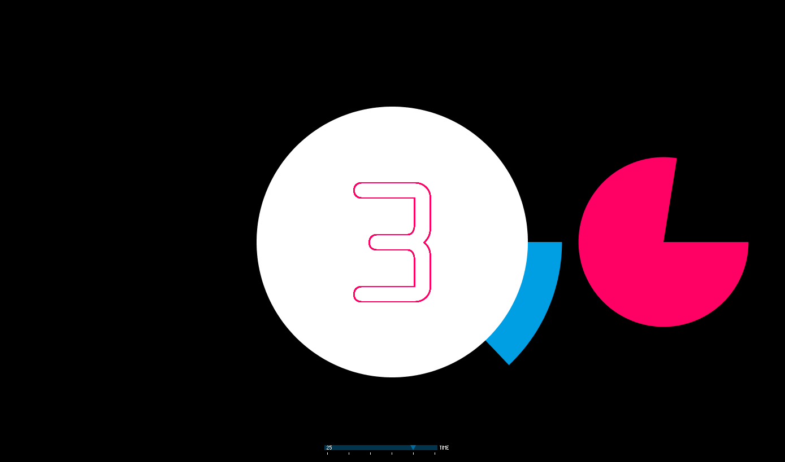

# Sound to Light

_Mathias Demmer_

>„Obwohl also die Bestandteile von Alltagsobjekten der Quantenphysik gehorchen,
bilden Newtons Gesetze eine effektive Theorie, die das Verhalten der zusammengesetzten Strukturen,
die unseren Alltagswelt ausmachen, sehr genau beschreibt“   

Stephen Hawking

### Zufall in der Physik
Was Hawking hiermit meint ist nicht unbedingt direkt ersichtlich. Ohne zu tief in die Quantenphysik einsteigen zu wollen, will ich nur kurz umreißen was diese von Newtons Gesetzen unterscheidet. 

Mitte des 17. Jahrhunderts revolutionierte Newton die Weltanschauung in eine bis heute prägende Weise, es war die Geburtsstunde von Ursache und Wirkung. Alles hing nun zusammen und konnte »logisch« erklärt werden. Den meisten sind vor allem Newtons Gesetze der Mechanik bekannt: Die Trägheit der Masse, Kraft gleich Maße mal Beschleunigung und vor allem Aktion gleich Reaktion. Dies wurde nicht nur auf physikalische Prozess angewandt sondern beeinflusste auch viele andere Disziplinen, wie Soziologie oder Pädagogik. Die Quantenphysik umreißt Hawking so: „Die Quantenphysik sagt uns, dass, egal wie gründlich unsere Beobachtungen der Gegenwart sein mögen, die (unbeobachtete) Vergangenheit wie die Zukunft, unbestimmt ist und nur als Spektrum von Möglichkeiten existiert.   
Das Universum hat laut Quantenphysik nicht nur eine einzige Vergangenheit, nicht nur eine einzige Geschichte.“ Vielleicht kann man die Quantenphysik als Theorie der Möglichkeiten verstehen. Dies ist natürlich nicht so bequem wie sich auf Liniarität zu verlassen. Letztendlich stellt sich hier auch die Frage nach Schicksal oder Selbstbestimmung.
Vielleicht wird die digitale Welt um so Realer um so Zufälliger sie wird. Aber wollen wir das? Lieben wir nicht die Kontrolle die wir über dieses System haben, jene Kontrolle die wir durch die Quantenphysik in unsere Welt verloren haben.

### Zufall als Entscheidungshilfe
Im alltäglichen Umgang mit Musik nutzen wir den angeblichen Zufall um uns Entscheidungen abzunehmen. Ein Beispiel hier für ist die Shuffel-Funktion. Jedes Lied einer Liste soll wahllos abgespielt werden, jedoch nur einmal. Das mutet für uns viel logischer an als das ein Song drei oder hundertmal hintereinander gespielt wird. Was die gleiche Wahrscheinlichkeit hätte. So ist es auch wenn wir uns ein Bild mit Regentropfen auf Asphalt anschauen. Wir erwarten eine gleichmäßige Verteilung, wenn man genau hinschaut entsteht jedoch eine sehr unregelmäßige Verteilung. Erst mit genügend Abstand wird das Bild gleichmäßiger. Also suchen wir oftmals gar nicht den wahren Zufall, sondern wollen gewisse Parameter selbst festlegen. Nur gewisse Entscheidungen geben wir ab, die die uns nicht interessieren oder diejenigen die für ausreichend Abwechslung sorgen. Weiterentwickelt wurde dies in der Ginius-Funktion bei iTunes wo wir nur die grobe Richtung vorgeben oder in in den weiterverbreiteten Radiofunktion (Beispielsweise bei Spotify). Wir wollen neue Songs entdecken ohne uns darum zu kümmern sie zu suchen.  

An dieser Stelle muss man vorsichtig sein, denn obwohl wir überzeugt sind die Richtung vorgegeben zu haben wissen wir nicht wer die Reise steuert. Die Frage die sich hier stellt ist: Wie weit will man seine Kontrolle abgeben und ab wann rutscht man in die Unmündigkeit ab? Wir reden hier nur über Musik, aber funktioniert unser Onlinesuche nicht nach ganz ähnlich?
Festhalten kann man hier das der gelenkte Zufall, in manchen Bereichen als Entscheidungshilfe durchaus sinnvoll ist, man jedoch die Grenzen kennen sollte.

### Zufall als Sicherheit
Unsere Sicherheitspassworter sind je besser desto mehr Stellen und Variable bzw. Möglichkeiten sie enthalten. Trotzdem kann man hier noch von Möglichkeiten sprechen und mit genügend Zeit und Rechenleistung lässt sich jede Kombination finden. Hier bei sind die Rahmenbedingungen entscheidend. So lässt sich ein Fahrrad-Zahlenschloss mit 6 Stellen und jeweils 10 möglichen Optionen kaum von einem Fahrraddieb knacken. In der digitalen Welt hat man meistens nur eine begrenzte Anzahl an Versuchen, wie beim Handy Pin. Beispiele für wirkliche Zufalls Verschlüsselungen im Netz sind das Netzwerk Tor, das sowohl zu guten Zwecken als auch zu illegalen Zwecken genutzt wird. Ein anderes populäres Beispiel ist die digitale Währung BitCoun.

### Mein Sketch
Ich möchte musikalische Möglichkeiten schaffen ohne ihr Ergebnis voraus sagen sagen zu können. Dabei benutze ich ein vereinfachtes Model, das wie Newtons Gesetze, ausreicht um das Prinzip zu verstehen. Hierzu verwende ich mehrere Tonspuren die eine gewisse Anzahl an Optionen haben. Diese werden im nächsten Schritt kombiniert um kurze Clips zu erzeugen. Damit jedoch ein gewisse Maß Harmonie gegeben ist halte ich mich an bestimmte musikalische Vorgaben. Bei der Wahl der Optionen kommt das nächste Modul zum Einsatz, der Zufall. Hierbei die von Processing vorgesehen Random-Funktion, die nur einem scheinbarem Zufall entspricht. Mit der kritischen Frage ob ein pseudo Zufall nicht die gleiche Qualität hat wie ein »echter« Zufall. Merken wir den Unterschied?
Letzt endlich soll mein Sketch das obere Zitat akustisch und visuell widerspiegeln und dem Betrachter die Möglichkeit geben selbst zu entscheiden ob Newtons Gesetze bzw. die Kausalität ausreicht um eine Welt zu beschreiben die vielmehr aus Möglichkeiten besteht als aus Reaktionen.
